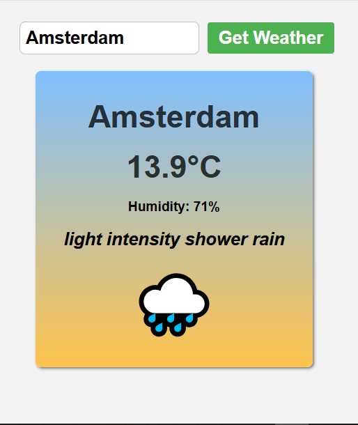

# Weather App 🌤️

A simple weather application built using HTML, CSS, and JavaScript.

## Features
- Search weather by city
- Real-time temperature data
- Weather conditions display
- Responsive user interface

## Technologies Used
- HTML
- CSS
- JavaScript
- OpenWeather API

## Live Demo
[Live Demo](https://z2zohashaikhh.github.io/weather-app/)

## Screenshot

## Author
Zoha Shaikh